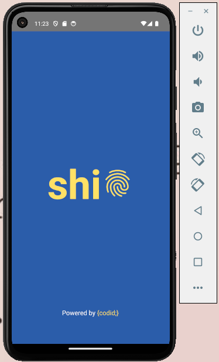
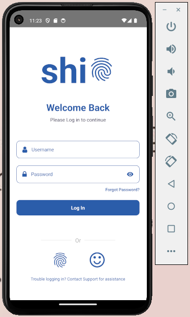

# Task:

- [Figma File](https://www.figma.com/design/QdYe6UPQs7HkwnEXlfDKIH/New-Task?node-id=0-1&node-type=canvas&t=T5iv6WtttoH0HdV2-0)

# My Screenshots:

- Splash Screen

 

- Login Screen



##  Get Started <a id = "started"></a>

<ol>
<li>Clone the repository

<br>

```
git clone https://github.com/MenaTalhHossamAlden/Shift.git
```

</li>
<li>Open project

<br>

```
cd Shift
```

</li>
<li>Install dependencies

<br>

```
npm install
```

</li>
<li>Run the program

<br>

```
npm start
```

</li>
